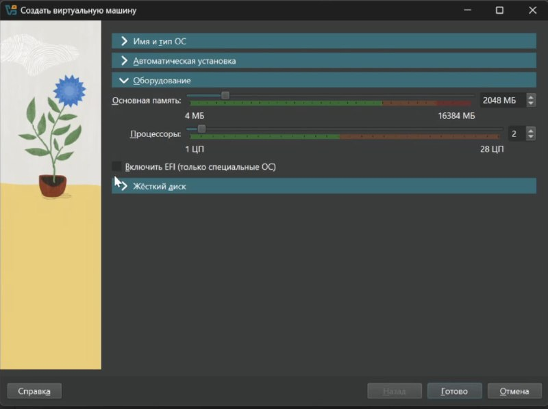
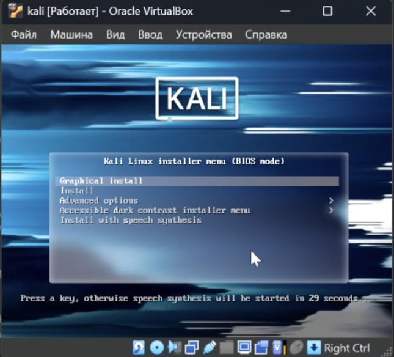
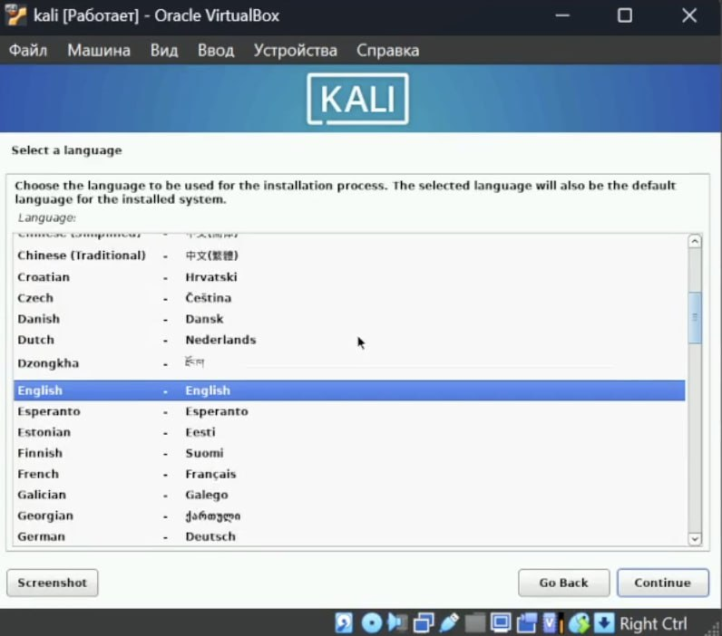
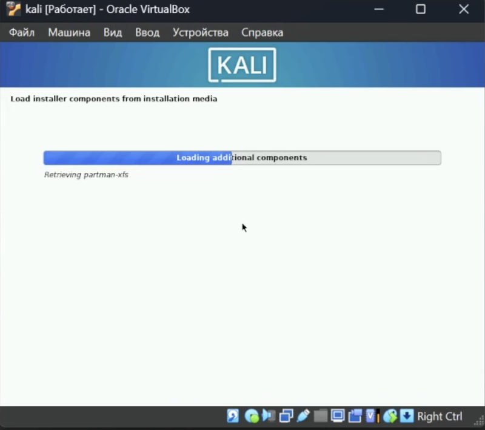

---
## Front matter
lang: ru-RU
title: Этап 1. Установка Kali Linux
subtitle: Индивидуальный проект
author:
  - А.Н. Сущенко
institute:
  - Российский университет дружбы народов, Москва, Россия
  - Объединённый институт ядерных исследований, Дубна, Россия
date: 26 февраля 2025

## i18n babel
babel-lang: russian
babel-otherlangs: english

## Formatting pdf
toc: false
toc-title: Содержание
slide_level: 2
aspectratio: 169
section-titles: true
theme: metropolis
header-includes:
 - \metroset{progressbar=frametitle,sectionpage=progressbar,numbering=fraction}
---

# Информация

## Докладчик

:::::::::::::: {.columns align=center}
::: {.column width="70%"}

  * Сущенко Алина Николаевна
  * студентка НПИбд-01-23
  * Российский университет дружбы народов

:::
::: {.column width="30%"}

:::
::::::::::::::

# Вводная часть

## Актуальность

- Актуальность данной работы заключается в исследовании новой ОС Kali
- И работой с виртаульной машиной

## Объект и предмет исследования

- ОС Kali

## Цели и задачи

- Создать и настроить на своей виртуальной машине ОС Kali.
- Разобраться во внутренних настройках.
- Удостовериться в работе данной ОС.

## Материалы и методы

- Программа 'VirtualBox'
- OC 'Kali'

## Актуальность

- Актуальность данной работы заключается в исследовании новой ОС Kali
- И работой с виртаульной машиной

## Цели и задачи

- Создать и настроить на своей виртуальной машине ОС Kali.
- Разобраться во внутренних настройках.
- Удостовериться в работе данной ОС.

## Материалы и методы

- ОС Kali linux.
- VirtualBox

## Содержание исследования

Установим выбранную ОС в виртуальной машине (как указано по минимальным возмодным значениям).

Все настройки виртуальной машины.

После загрузки Kali предлагает настроить рабочее место через BIOS.

В настройках нам предлагают выбрать язык, разметку диска, выбор программного обеспечения, GRUB boot loader и т.д.

Далее мы оставляем загружать нужные нам компоненты, параллельно выставляя параметры, о которых уже было сказано пунктом выше.

После загрузки перезапустим виртуальную машину. Нас встречает экран рабочего стола.

 

## Результаты

- Мы установили Kali и проверили работу данной ОС.

## Итоговый слайд

- В течение выполнения данной работы нам удалось установить и проверить работу Kali в виртуальной машине.

:::

