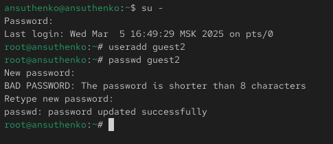
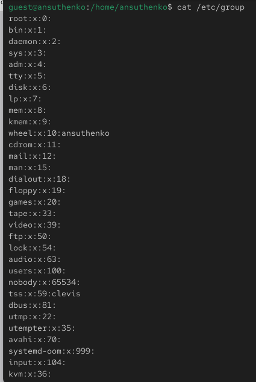
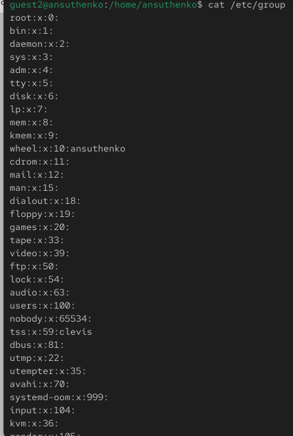

---
## Front matter
lang: ru-RU
title: Лабораторная работа №3
subtitle: Информационная безопасность
author:
  - Сущенко А.Н.
institute:
  - Российский университет дружбы народов имени Патриса Лумумбы, Москва, Россия
date: 2024

## i18n babel
babel-lang: russian
babel-otherlangs: english

## Formatting pdf
toc: false
toc-title: Содержание
slide_level: 2
aspectratio: 169
section-titles: true
theme: metropolis
header-includes:
 - \metroset{progressbar=frametitle,sectionpage=progressbar,numbering=fraction}
 - '\makeatletter'
 - '\beamer@ignorenonframefalse'
 - '\makeatother'
---

## Докладчик

:::::::::::::: {.columns align=center}
::: {.column width="70%"}

  * Сущенко Алина Николаевна
  * Студент группы НПИбд-01-23
  * Студ. билет 1123321439
  * Российский университет дружбы народов имени Патриса Лумумбы

:::
::: {.column width="30%"}


:::
::::::::::::::


## Цель лабораторной работы

- Получить навыки работы в консоли с атрибутами файлов для групп пользователей.

## Теоретическая справка (1)

**Права доступа** определяют, какие действия конкретный пользователь имеет право совершать с определенным 
файлами и каталогами. С помощью разрешений можно создать надежную среду — такую, в которой никто не может поменять содержимое 
ваших документов или повредить системные файлы.

## Теоретическая справка (2)

**Группы пользователей Linux** кроме стандартных root и users, здесь есть еще пару десятков групп. 
Это группы, созданные программами, для управления доступом этих программ к общим ресурсам. Каждая группа разрешает 
чтение или запись определенного файла или каталога системы, тем самым регулируя полномочия пользователя, а следовательно, 
и процесса, запущенного от этого пользователя. Здесь можно считать, что пользователь - это одно и то же что процесс, 
потому что у процесса все полномочия пользователя, от которого он запущен.

# Ход выполнения лабораторной работы

## Cоздание учётной записи пользователя guest2, изменение пароля для пользователя guest2

{ #fig:001 width=100% height=100% }

## Добавление пользователя guest2 в группу guest

{ #fig:002 width=100% height=100% }

## Осуществление входа в систему двух пользователей

{ #fig:003 width=100% height=100% }

## Определение директорий и сравнение

{ #fig:004 width=100% height=100% }

{ #fig:005 width=100% height=100% }

## Уточнение имени пользователя, группы, кто входит и к каким группам принадлежит

{ #fig:006 width=100% height=100% }

{ #fig:007 width=100% height=100% }}

## Сравнение полученной информацию с содержимым файла

{ #fig:008 width=100% height=100% }

{ #fig:009 width=100% height=100% }

## Выполнение регистрации пользователя guest2 в группе guest

{ #fig:010 width=100% height=100% }

## Изменение прав директории /home/guest

{ #fig:011 width=100% height=100% }

## Проверка правильности снятия атрибутов

{ #fig:012 width=100% height=100% }

## Заполнение таблицы 3.1

|   Права директории   |      Права файла     | Создание файла| Удаление файла | Запись в файл | Чтение файла | Смена директории | Просмотр файлов в директории | Переименование файл | Смена атрибутов файла |
|:---------------------|:---------------------|-----|-----|-----|-----|-----|-----|-----|-----|
|```d--------- (000)```|```---------- (000)```|  -	|  -  |  -  |  -  |  -	|  -  |  -  |  -  |

Целиком таблицу можно просмотреть в файле отчета.

## Заполнение таблицы 3.2

|        Операция        | Права на директорию | Права на файл |
|------------------------|---------------------------------|---------------------------|
|     Создание файла     |           ```d----wx--- (030)```      |      ```---------- (000)```     |	    
|     Удаление файла     |           ```d----wx--- (030)```      |      ```---------- (000)```     |
|      Чтение файла      |           ```d-----x--- (010)```      |      ```----r----- (040)```     |
|      Запись в файл     |           ```d-----x--- (010)```      |      ```-----w---- (020)```     |
|  Переименование файла  |           ```d----wx--- (030)```      |      ```---------- (000)```     |
| Создание поддиректории |           ```d----wx--- (030)```      |      ```---------- (000)```     |
| Удаление поддиректории |           ```d----wx--- (030)```      |      ```---------- (000)```     |

## Сравнение

Сравнивая таблицу 3.1. с таблицей 2.1, можно сказать, что они идентичны. Единственное различие в том, 
что в предыдущий раз мы присваивали права владельцу, а в этот раз группе.

# Вывод

## Вывод

- В ходе выполнения лабораторной работы были получены навыки работы в консоли с атрибутами 
файлов для групп пользователей.
