---
## Front matter
lang: ru-RU
title: Лабораторная работа №2
subtitle: Информационная безопасность
author:
  - Сущенко А. Н.
institute:
  - Российский университет дружбы народов имени Патриса Лумумбы, Москва, Россия
date: 2024

## i18n babel
babel-lang: russian
babel-otherlangs: english

## Formatting pdf
toc: false
toc-title: Содержание
slide_level: 2
aspectratio: 169
section-titles: true
theme: metropolis
header-includes:
 - \metroset{progressbar=frametitle,sectionpage=progressbar,numbering=fraction}
 - '\makeatletter'
 - '\beamer@ignorenonframefalse'
 - '\makeatother'
---

## Докладчик

:::::::::::::: {.columns align=center}
::: {.column width="70%"}

  * Сущенко Алина Николаевна
  * Студент группы НПИбд-01-23
  * Студ. билет 1132231439
  * Российский университет дружбы народов имени Патриса Лумумбы

:::
::: {.column width="30%"}

:::
::::::::::::::

## Цель лабораторной работы

- Получить практические навыки работы в консоли с атрибутами файлов, закрепить теоретические основы дискреционного 
разграничения доступа в современных системах с открытым кодом на базе ОС Linux.

# Ход выполнения лабораторной работы

# Атрибуты файлов

## Cоздание учётной запись пользователя guest 

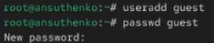{ #fig:001 width=100% height=100% }

## Вход в систему от имени пользователя guest

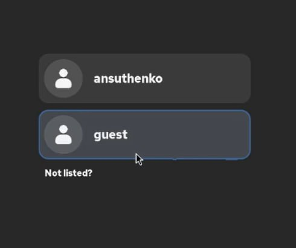{ #fig:002 width=100% height=100% }

## Определение директории, в которой находимся

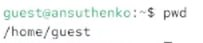{ #fig:003 width=90% height=90% }

## Уточнение имени нашего пользователя

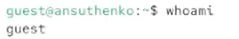{ #fig:004 width=100% height=100% }

## Уточнение имени пользователя

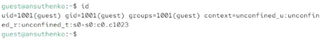{ #fig:005 width=100% height=100% }

## Уточнение группы (также куда входит)

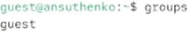{ #fig:006 width=100% height=100% }

## Просмотр файла /etc/passwd

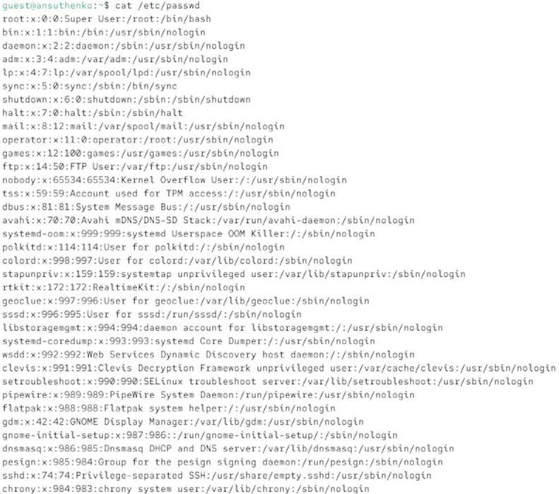{ #fig:007 width=100% height=100% }

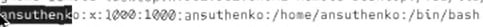{ #fig:008 width=100% height=100% }

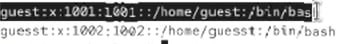{ #fig:009 width=100% height=100% }

## Определение существующих в системе директорий

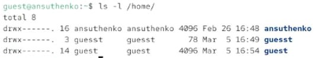{ #fig:010 width=90% height=90% }

## Проверка расширенных атрибутов, установленых на поддиректориях

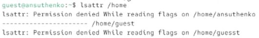{ #fig:011 width=100% height=100% }

## Создание поддиректории dir1 и определение прав доступа

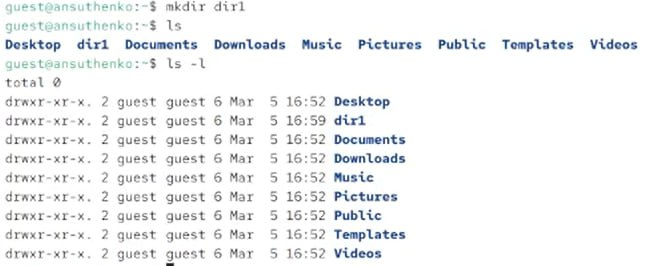{ #fig:012 width=100% height=100% }

## Снятие с директории dir1 всех атрибутов

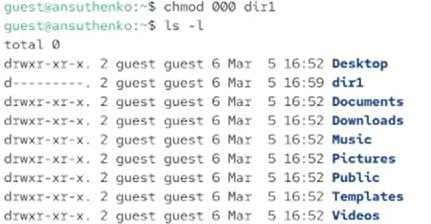{ #fig:013 width=90% height=90% }

## Попытка создать в директории dir1 файл file1

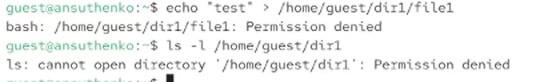{ #fig:014 width=100% height=100% }

## Заполненная таблица «Установленные права и разрешённые действия» (табл. 2.1)

| | | | | | | | | | |
|-|-|-|-|-|-|-|-|-|-|
|Права директории|Права  файла|Создание  файла|Удаление  файла|Запись  в файл|Чтение  файла|Смена  директории|Просмотр файлов в  директории|Переимено- вание файла|Смена  атрибутов  файла|
|d(000)|(000)| -| -| -| -| -| -| -| -|
|d(000)|(100)| -| -| -| -| -| -| -| -|
|d(000)|(200)| -| -| -| -| -| -| -| -|
|d(000)|(300)| -| -| -| -| -| -| -| -|
|d(000)|(400)| -| -| -| -| -| -| -| -|
|d(000)|(500)| -| -| -| -| -| -| -| -|
|d(000)|(600)| -| -| -| -| -| -| -| -|

Таблица 2.1 «Установленные права и разрешённые действия»

## Заполненная табл. 2.2

| | | | | |
|-|-|-|-|-|
|Операция| |Минимальные  права на  директорию| |Минимальные  права на файл|
|Создание файла| |d(300)| |(000)|
|Удаление файла| |d(300)| |(000)|
|Чтение файла| |d(100)| |(400)|
|Запись в файл| |d(100)| |(200)|
|Переименование файла| |d(300)| |(000)|
|Создание поддиректории| |d(300)| |(000)|
|Удаление поддиректории| |d(300)| |(000)|

Таблица 2.2 "Минимальные права для совершения операций"

# Вывод

## Вывод

- В ходе выполнения лабораторной работы были получены практические навыки работы в консоли с атрибутами файлов, закреплены теоретические основы дискреционного 
разграничения доступа в современных системах с открытым кодом на базе ОС Linux.
