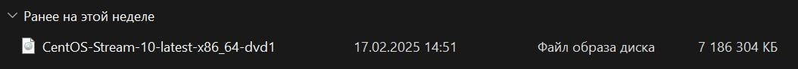
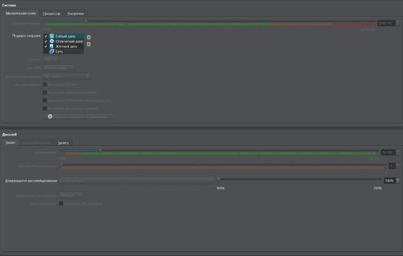
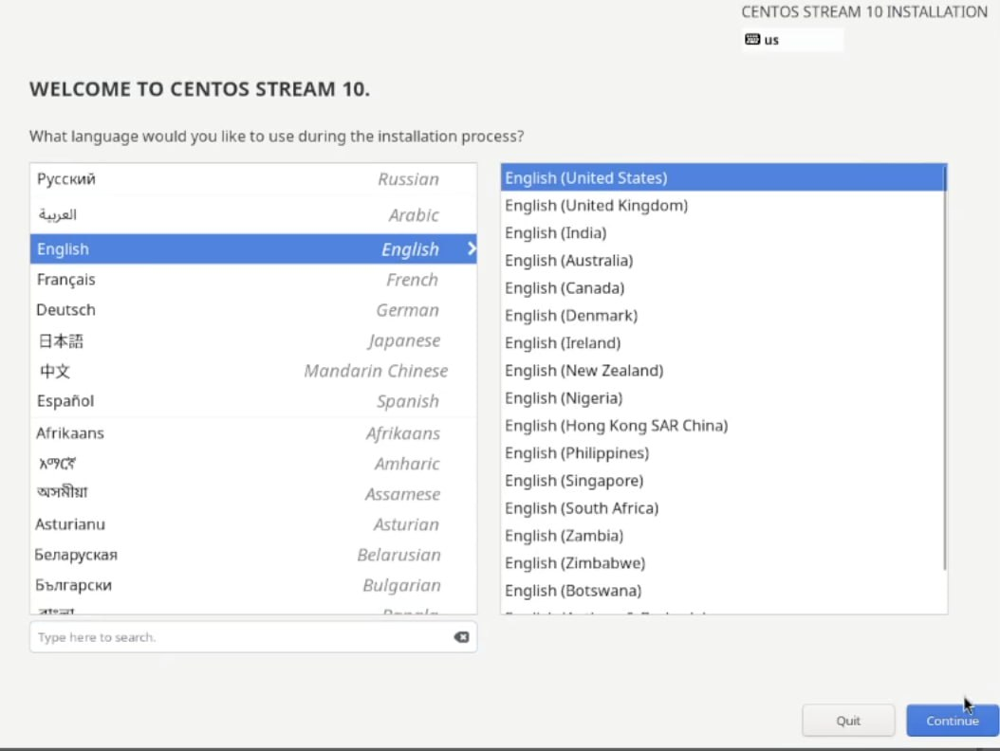
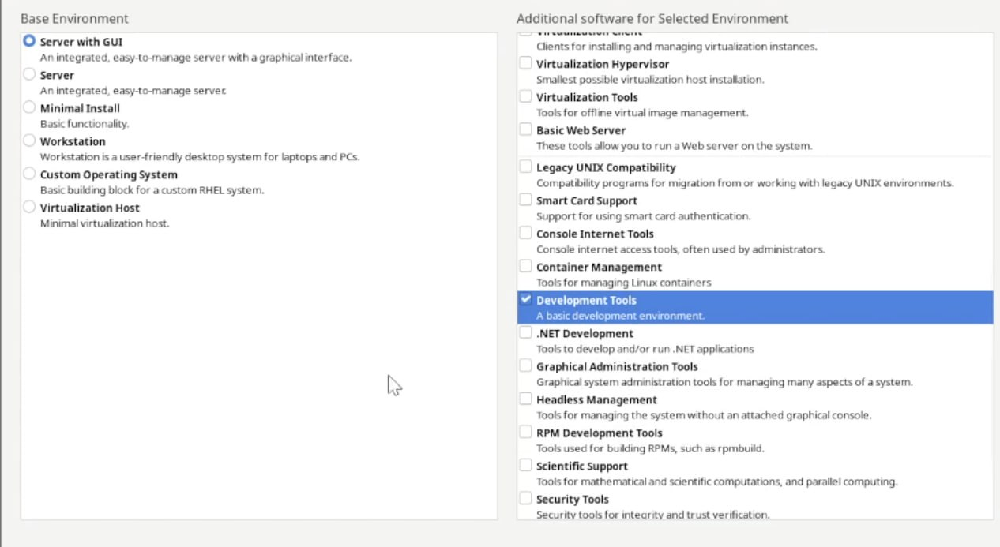
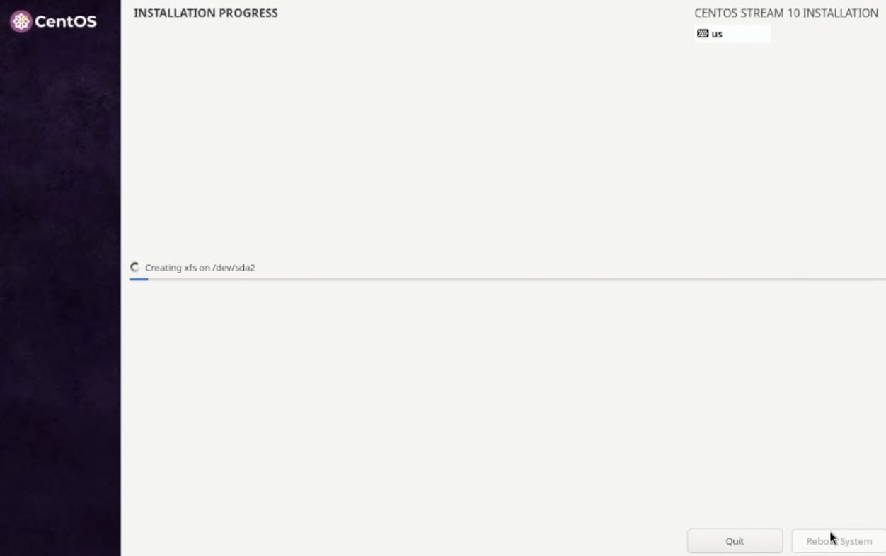
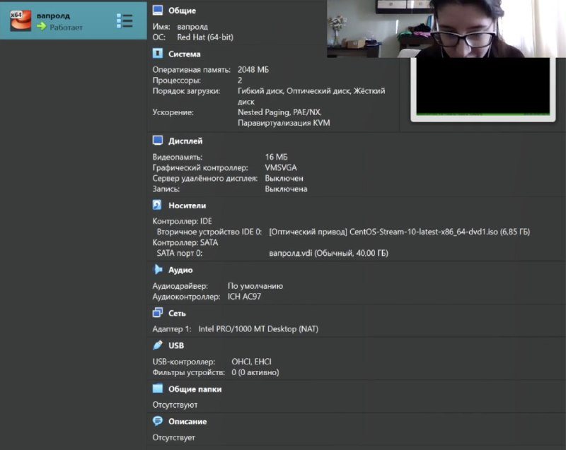
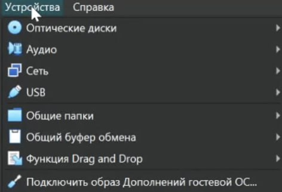
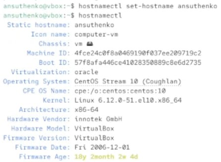
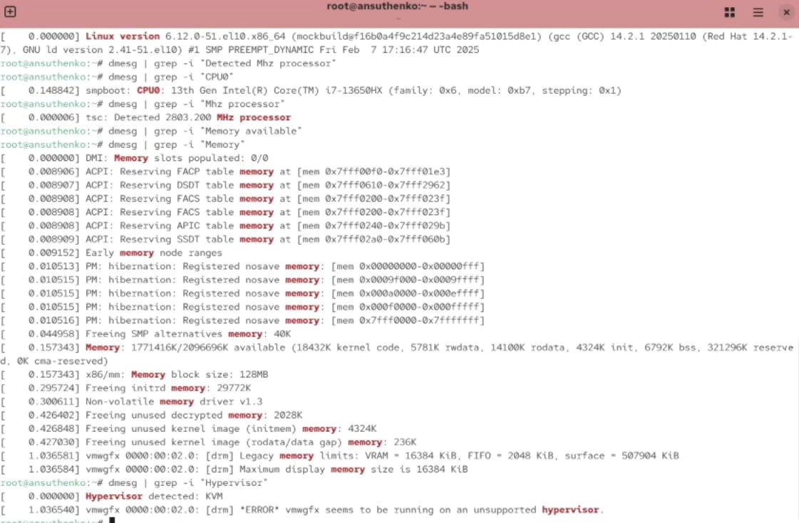

    ## Отчёт по лабораторной работе №1: Виртуализация с использованием VirtualBox

**Цель работы:** Приобретение практических навыков установки и настройки виртуальной машины на базе VirtualBox.

**Задачи:**

1. Установка и настройка VirtualBox на хост-системе.
2. Создание новой виртуальной машины в VirtualBox.
3. Установка гостевой операционной системы (ОС) на виртуальную машину.
4. Настройка параметров виртуальной машины.
5. Установка и настройка "Guest Additions" VirtualBox.
6. Проверка работоспособности установленной виртуальной машины.

**Выполнение работы:**

1. **Установка и настройка VirtualBox:**
    *   Скачан установочный файл VirtualBox с официального сайта.
    
    *   Запущен процесс установки VirtualBox, приняты лицензионные соглашения.
    *   Выбраны компоненты для установки (оставлены параметры по умолчанию).
    *   При установке было запрошено разрешение на установку сетевых адаптеров VirtualBox. Разрешение было предоставлено.
    *   После завершения установки VirtualBox был запущен.

2. **Создание виртуальной машины:**
    *   В главном окне VirtualBox нажата кнопка "Создать".
    *   Введено имя виртуальной машины:.
    *   Выбран тип ОС: "Linux" и версия.
    *   Выделено 2048 MB оперативной памяти для виртуальной машины.
    *   Создан виртуальный жесткий диск:
        *   Выбран тип виртуального жесткого диска: "VDI (VirtualBox Disk Image)".
        *   Выбран формат хранения: "Динамический виртуальный жесткий диск".
        *   Выделено  местo на жестком диске для виртуальной машины.
        *   Указано имя файла виртуального дискa.

3. **Установка гостевой ОС:**
    *   В настройках созданной виртуальной машины, в разделе "Носители", добавлен ISO-образ Centos в качестве виртуального CD/DVD-ROM привода.
    *   Запущена виртуальная машина.
    *   В процессе установки выбраны следующие параметры:

    *   После завершения установки виртуальная машина перезагружена.

    *   Подключаем гостевую ОС.

    *   Задаём имя пользователя,пароль,имя хоста.

4. **Домашнее задание:**
        Нужно получить следующую информацию:
    *   Версия ядра Linux (Linux version).
    *   Частота процессора (Detected Mhz processor).
    *   Модель процессора (CPU0).
    *   Объем доступной оперативной памяти (Memory available).
    *   Тип обнаруженного гипервизора (Hypervisor detected).
    *   Тип файловой системы корневого раздела.

**Результаты:**

В ходе выполнения лабораторной работы была успешно установлена и настроена виртуальная машина Centos на базе VirtualBox. Все поставленные задачи были выполнены. Была проверена работоспособность основных функций виртуальной машины, включая сеть, общий буфер обмена, перетаскивание файлов и автоматическое изменение размера экрана.

**Выводы:**

Работа с VirtualBox позволяет создавать и использовать виртуальные машины для различных целей, таких как тестирование программного обеспечения, разработка, изучение новых операционных систем и создание изолированных сред. Установка и настройка VirtualBox и гостевой ОС не представляет особых сложностей при соблюдении инструкций. Установка "Guest Additions" значительно повышает удобство работы с виртуальной машиной. Виртуализация является полезным инструментом для разработчиков, системных администраторов и обычных пользователей.

**Дата:** [20.02.25]
**Студент:** [А.Н.Сущенко]
**Группа:** [НПИбд-01-23]
